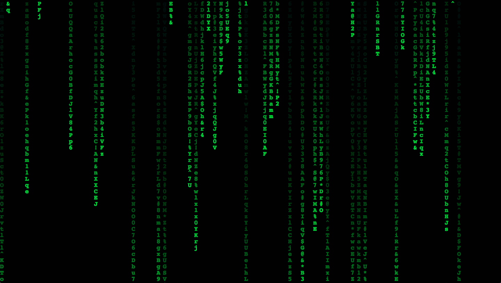

# Canvas Matrix

An amazing backgroud effect of website draw on canvas. It shows text flying in and out like as seen in "The Matrix" movie.

**WARNING: DO NOT SUPPORT IE.**

## Preview


## Feature
- Do not depend on jQuery.
- Small size, less than 2Kb.
- Easy to implement, simple configuration.
- You do not have to be a web developer to use it.

## How to use
Download:
```bash
# Clone this repository
git clone https://github.com/stevenjoezhang/canvas-matrix.js.git
# Go into the repository
cd canvas-matrix.js
```
then add this script to your html page:
```xml
<script src="path/to/canvas-matrix.js"></script>
```
or:
```xml
<script src="path/to/canvas-matrix.min.js"></script>
```

### Using CDN
```xml
<script src="https://cdn.jsdelivr.net/gh/stevenjoezhang/canvas-matrix.js/canvas-matrix.min.js"></script>
```

## Config
- `size` font-size in px
- `font` font-name

For example:
```xml
<script src="path/to/canvas-matrix.js" size="20" font="arial"></script>
```

## Credits
* [Mimi](https://zhangshuqiao.org) Developer of this project.

## License
Released under the GNU General Public License v3  
http://www.gnu.org/licenses/gpl-3.0.html

## TODO
- Add more chars like `さかもとですか`
